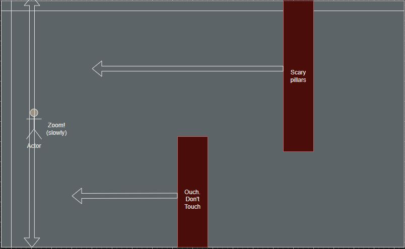

# Sidescroller Pitch
I plan on building a side scroller arcade game similar to flappy bird with a player controlled character that moves up based on a keypress and begins falling down when there are no keys being pressed. The main goal is to complete the level while avoiding hitting any obstacles that show up along the way, either from the top or the bottom of the game canvas. Thematically I plan on going with something that deviates from the flappy bird aesthetic, although I haven't finalized which theme I ultimately want to go with.

# Tech Stack
HTML/CSS/JS

JS Canvas

# Wireframe

# MVP Goals
* A start screen with the background continuously moving foward but without obstacles.
* On game start, place the player controlled avatar and begin spawning obstacles.
* One statically designed stage with intentionally placed obstacles in order to strictly control difficulty.
* A finish line at the end of the stage to determine the win condition.
* Obstacles that will determine the fail condition if touched by the player avatar.
* Restart button on either/both Win and Loss screens.

# Stretch Goals
* Add MIDI music
* Implement an 'Infinite Run' mode that utilizes randomly generated obstacles.
* Adjust the game so that it can work either on PC using a keyboard or on a phone/tablet using the touch screen.
* Moderate stretch goal - change movement style to WASD and give the avatar a gun to destroy obstacles with.
* Super EXTRA stretch goal - Reforctor the game into a Galaga variant with enemies and weapons.

# Potential Roadblocks
* 0 previous experience interacting with mobile devices so that should create plenty of frustrating/fun new problems to solve for when implementing the stretch goals.

# Sources
Image Assets: "www.kenney.nl" / "www.opengameart.org"

Audio: "www.freemidi.org"